# Design Document

## Rakshak AI Research Dataset Repository

---

## Overview

The Rakshak AI Research Dataset is a structured, folder-based synthetic data repository designed to support AI/ML model development, NLP-based threat classification, rule-based risk scoring, dashboard analytics, and CERT escalation workflow testing for the **Rakshak AI Defence Cyber Safety Portal**.

All data is entirely synthetic and generated for research and testing purposes. The dataset models Indian defence-related cyber threat scenarios including phishing, APK malware, scam messages, and complaint records targeting defence personnel, veterans, and their families.

### Design Goals

- Provide realistic, reproducible synthetic data that mirrors real-world Indian defence cyber threat patterns
- Enforce strict cross-file consistency in identifiers, timestamps, threat labels, and risk scores
- Support multiple AI/ML use cases: URL classification, NLP text classification, APK threat detection, complaint triage, and dashboard analytics
- Be self-documenting with methodology, references, and usage guidelines embedded in the repository

### Scope

This design covers the complete file layout, schema specifications, content rules, cross-file consistency constraints, and data generation approach for the entire dataset repository. It does not cover the Rakshak AI portal application code itself.

---

## Architecture

The repository is a flat, folder-based static data store. There is no runtime component — all files are pre-generated and committed to the repository. The architecture is intentionally simple: structured folders containing JSON, CSV, TXT, and Markdown files.

```mermaid
graph TD
    ROOT["rakshak-ai-research-dataset/"]
    ROOT --> FC["fake_complaints/"]
    ROOT --> PU["phishing_urls/"]
    ROOT --> SM["scam_messages/"]
    ROOT --> AS["apk_samples/"]
    ROOT --> TE["testing_exports/"]
    ROOT --> SS["screenshots/"]
    ROOT --> DR["dataset_references/"]
    ROOT --> RM["README.md"]

    FC --> FC1["complaint_samples.json"]
    FC --> FC2["complaint_export.csv"]
    FC --> FC3["complaint_summary.md"]

    PU --> PU1["phishing_links.txt"]
    PU --> PU2["malicious_domains.csv"]
    PU --> PU3["url_risk_labels.json"]

    SM --> SM1["sms_scams.txt"]
    SM --> SM2["whatsapp_scams.txt"]
    SM --> SM3["telegram_scams.txt"]
    SM --> SM4["social_engineering_samples.md"]

    AS --> AS1["fake_apk_alerts.json"]
    AS --> AS2["suspicious_apk_names.txt"]
    AS --> AS3["apk_analysis_report.md"]

    TE --> TE1["ai_detection_results.csv"]
    TE --> TE2["dashboard_metrics.json"]
    TE --> TE3["cert_escalation_logs.txt"]

    SS --> SS1["README.md"]

    DR --> DR1["source_references.md"]
    DR --> DR2["dataset_methodology.md"]
```



### Data Flow

The dataset is consumed by downstream systems in three primary ways:

1. **Direct file ingestion** — AI/ML pipelines read JSON/CSV files directly for model training and evaluation
2. **Dashboard seeding** — `testing_exports/dashboard_metrics.json` seeds the Rakshak AI portal analytics view
3. **CERT workflow testing** — `testing_exports/cert_escalation_logs.txt` and complaint records drive escalation workflow validation

---

## Components and Interfaces

### 1. fake_complaints/

**Purpose:** Structured complaint records for testing complaint ingestion, threat classification, and CERT escalation workflows.

#### complaint_samples.json

- Format: JSON array of Complaint_Record objects
- Minimum records: 15
- Encoding: UTF-8

Schema per record:
```json
{
  "complaint_id": "RKS-2024-0001",
  "threat_type": "Phishing",
  "risk_level": "High",
  "risk_score": 85,
  "description": "Received a fake SMS claiming to be from SBI defence salary account...",
  "evidence_type": "Screenshot",
  "complaint_status": "Open",
  "user_role": "Defence_Personnel",
  "cert_escalation_status": "Escalated",
  "timestamp": "2024-03-15T10:30:00Z"
}
```

Field constraints:
- `complaint_id`: String, format `RKS-YYYY-NNNN` (e.g., `RKS-2024-0001`)
- `threat_type`: Enum — `Phishing`, `APK_Malware`, `Impersonation`, `Banking_Fraud`, `OTP_Scam`
- `risk_level`: Enum — `High` (score 75–100), `Medium` (score 40–74), `Low` (score 0–39)
- `risk_score`: Integer, 0–100
- `description`: String, realistic Indian defence scenario narrative (50–200 chars)
- `evidence_type`: Enum — `Screenshot`, `URL`, `APK_Hash`, `SMS_Log`, `Call_Recording`
- `complaint_status`: Enum — `Open`, `Under_Review`, `Resolved`, `Closed`
- `user_role`: Enum — `Defence_Personnel`, `Veteran`, `Family_Member`
- `cert_escalation_status`: Enum — `Pending`, `Escalated`, `Resolved`
- `timestamp`: ISO 8601 string (`YYYY-MM-DDTHH:MM:SSZ`)

Business rule: `cert_escalation_status = "Escalated"` requires `risk_score >= 70`.

Distribution target (across 15+ records):
- All 5 threat types represented
- Mix of High/Medium/Low risk levels
- At least 3 records with `cert_escalation_status = "Escalated"`
- All 3 user roles represented

#### complaint_export.csv

- Format: CSV with header row
- Columns (in order): `complaint_id`, `threat_type`, `risk_level`, `risk_score`, `description`, `evidence_type`, `complaint_status`, `user_role`, `cert_escalation_status`, `timestamp`
- Records: Identical to `complaint_samples.json` — same IDs, same values
- Encoding: UTF-8, comma-delimited, fields with commas quoted

#### complaint_summary.md

Structure:
```
# Complaint Dataset Summary

## Overview
[Brief description of the dataset]

## Distribution by Threat Type
[Table: threat_type | count | percentage]

## Distribution by Risk Level
[Table: risk_level | count | avg_risk_score]

## Distribution by Escalation Status
[Table: cert_escalation_status | count]

## Sample Records
[2–3 example records in readable format]
```

---

### 2. phishing_urls/

**Purpose:** Fake phishing URL data for URL-based threat detection model training and evaluation.

#### phishing_links.txt

- Format: Plain text, one URL per line
- Minimum entries: 15
- No headers, no metadata — raw URLs only
- Encoding: UTF-8

URL pattern rules:
- Must use fake/non-existent domains (no real domains)
- Patterns to include: typosquatting (e.g., `sbi-defence-portaI.in`), subdomain abuse (e.g., `login.army-welfare.fake-domain.com`), hyphenated impersonation (e.g., `sparsh-pension-update.net`)
- Must cover all 4 domain categories: Banking_Phishing, Welfare_Portal_Spoofing, KYC_Fraud, APK_Distribution

#### malicious_domains.csv

- Format: CSV with header row
- Columns: `domain`, `category`, `risk_score`, `detection_label`, `first_seen_date`
- Minimum records: 15 (matching phishing_links.txt domains)
- Encoding: UTF-8

Field constraints:
- `domain`: Bare domain (no protocol, no path), e.g., `sbi-defence-portaI.in`
- `category`: Enum — `Banking_Phishing`, `Welfare_Portal_Spoofing`, `KYC_Fraud`, `APK_Distribution`
- `risk_score`: Integer, 0–100
- `detection_label`: `Malicious` (risk_score > 70) or `Suspicious` (risk_score ≤ 70)
- `first_seen_date`: ISO 8601 date string (`YYYY-MM-DD`)

#### url_risk_labels.json

- Format: JSON array of URL risk objects
- Minimum records: 15

Schema per record:
```json
{
  "url": "https://sparsh-pension-update.net/verify",
  "risk_score": 88,
  "threat_category": "Welfare_Portal_Spoofing",
  "detection_label": "Malicious",
  "source": "Reported_by_User"
}
```

Field constraints:
- `url`: Full URL including protocol and path
- `risk_score`: Integer, 0–100
- `threat_category`: Enum — `Banking_Phishing`, `Welfare_Portal_Spoofing`, `KYC_Fraud`, `APK_Distribution`
- `detection_label`: `Malicious` (risk_score > 70) or `Suspicious` (risk_score ≤ 70)
- `source`: Enum — `Reported_by_User`, `Honeypot`, `CERT_Feed`, `Threat_Intel`

---

### 3. scam_messages/

**Purpose:** Realistic fake scam messages for NLP-based text classification and phishing detection model training.

#### sms_scams.txt

- Format: Plain text
- Minimum entries: 10
- Separator: Each message separated by a blank line
- Encoding: UTF-8

Content rules:
- Target audience: Defence personnel
- Must reference realistic Indian defence context: SPARSH pension, CSD canteen, Army welfare funds, ECHS, Sainik welfare boards
- Must cover at least 3 of the 6 scam categories: OTP_Scam, KYC_Fraud, Banking_Fraud, APK_Distribution, Impersonation, Welfare_Scheme_Fraud
- When a URL is referenced, it must match a URL from `phishing_urls/phishing_links.txt`

#### whatsapp_scams.txt

- Format: Plain text
- Minimum entries: 10
- Separator: Each message separated by a blank line
- Encoding: UTF-8

Content rules:
- Must include impersonation of defence officials (e.g., "Col. Sharma, Army Welfare Office")
- Must include welfare scheme fraud messages
- Must cover at least 3 of the 6 scam categories
- URL references must match `phishing_urls/phishing_links.txt`

#### telegram_scams.txt

- Format: Plain text
- Minimum entries: 10
- Separator: Each message separated by a blank line
- Encoding: UTF-8

Content rules:
- Must include APK distribution links (fake download links)
- Must include fake defence group invitations
- Must cover at least 3 of the 6 scam categories
- URL references must match `phishing_urls/phishing_links.txt`

#### social_engineering_samples.md

Structure:
```
# Social Engineering Message Patterns

## Overview

## Pattern 1: [Category Name]
**Threat Category:** [category]
**Channel:** [SMS/WhatsApp/Telegram]
**Sample Message:**
> [message text]

**Analysis:**
[Explanation of manipulation technique, urgency triggers, trust signals used]

**Indicators of Compromise:**
- [indicator 1]
- [indicator 2]

[Repeat for 5+ patterns]
```

Minimum: 5 annotated patterns, each covering a distinct scam category.

---

### 4. apk_samples/

**Purpose:** APK threat metadata for mobile security model testing and malware classification pipelines.

#### fake_apk_alerts.json

- Format: JSON array of APK alert objects
- Minimum records: 10

Schema per record:
```json
{
  "apk_id": "APK-2024-001",
  "apk_name": "SPARSH_Official_Update.apk",
  "package_name": "com.sparsh.defence.update",
  "source": "Telegram_Group",
  "malware_behavior": "Data_Exfiltration",
  "installation_risk": "High",
  "threat_category": "APK_Malware",
  "risk_score": 92,
  "reported_date": "2024-03-10T08:00:00Z"
}
```

Field constraints:
- `apk_id`: String, format `APK-YYYY-NNN` (e.g., `APK-2024-001`)
- `apk_name`: String, realistic fake APK filename ending in `.apk`
- `package_name`: String, fake Android package name (e.g., `com.sparsh.defence.fake`)
- `source`: Enum — `Telegram_Group`, `WhatsApp_Link`, `Third_Party_Store`
- `malware_behavior`: Enum — `Data_Exfiltration`, `SMS_Interception`, `Remote_Access_Trojan`, `Credential_Harvesting`
- `installation_risk`: Enum — `High`, `Medium`, `Low`
- `threat_category`: Always `APK_Malware` for this dataset
- `risk_score`: Integer, 0–100
- `reported_date`: ISO 8601 string (`YYYY-MM-DDTHH:MM:SSZ`)

Distribution target: All 4 malware behaviors and all 3 source channels represented.

#### suspicious_apk_names.txt

- Format: Plain text, one APK filename per line
- Minimum entries: 15
- Encoding: UTF-8

Content rules:
- All filenames must end in `.apk`
- Must impersonate Indian defence apps: SPARSH, ECHS, Army welfare, CSD canteen
- Include variations: version numbers, "official", "update", "verified" suffixes

#### apk_analysis_report.md

Structure:
```
# APK Threat Analysis Report

## Overview

## Threat Category Distribution
[Table: threat_category | count]

## Malware Behavior Analysis
[Table: malware_behavior | count | description]

## Risk Score Distribution
[Table: risk_level | count | score_range]

## Source Channel Analysis
[Table: source | count]

## Common Indicators of Compromise
[List of IOCs]

## Recommendations
[Usage guidance for AI model training]
```

---

### 5. testing_exports/

**Purpose:** Pre-generated AI detection results and dashboard metrics for validating the Rakshak AI portal without live data.

#### ai_detection_results.csv

- Format: CSV with header row
- Minimum records: 15
- Columns: `record_id`, `input_type`, `threat_category`, `predicted_label`, `confidence_score`, `actual_label`, `is_correct`, `timestamp`
- Encoding: UTF-8

Field constraints:
- `record_id`: String, format `DET-YYYY-NNNN` (e.g., `DET-2024-0001`)
- `input_type`: Enum — `URL`, `SMS`, `WhatsApp`, `Telegram`, `APK`
- `threat_category`: Enum — `Phishing`, `APK_Malware`, `Impersonation`, `Banking_Fraud`, `OTP_Scam`
- `predicted_label`: Enum — `Malicious`, `Suspicious`, `Benign`
- `confidence_score`: Float, 0.00–1.00 (2 decimal places)
- `actual_label`: Enum — `Malicious`, `Suspicious`, `Benign`
- `is_correct`: Boolean string — `True` or `False`
- `timestamp`: ISO 8601 string (`YYYY-MM-DDTHH:MM:SSZ`)

Distribution target:
- All 5 input types represented (at least 2 records each)
- All 5 threat categories represented
- `is_correct = True` for at least 85% of records (≥13 of 15)

#### dashboard_metrics.json

Schema:
```json
{
  "generated_at": "2024-03-20T12:00:00Z",
  "total_threats_detected": 47,
  "breakdown_by_threat_category": {
    "Phishing": 12,
    "APK_Malware": 9,
    "Impersonation": 8,
    "Banking_Fraud": 11,
    "OTP_Scam": 7
  },
  "average_risk_score": 72.4,
  "escalation_rate_percent": 34.0,
  "detection_accuracy_percent": 91.5,
  "total_complaints": 15,
  "escalated_complaints": 5,
  "resolved_complaints": 4,
  "pending_complaints": 6
}
```

Constraints:
- `generated_at`: ISO 8601 timestamp
- All counts must be positive integers
- `detection_accuracy_percent` must be ≥ 85.0
- `breakdown_by_threat_category` must include all 5 threat categories
- Sum of category counts must equal `total_threats_detected`

#### cert_escalation_logs.txt

- Format: Structured plain text log
- Minimum entries: 10
- Encoding: UTF-8

Log entry format (one entry per line):
```
[YYYY-MM-DDTHH:MM:SSZ] [LEVEL] complaint_id=RKS-YYYY-NNNN escalation_level=L1_Alert action="Initial triage completed" analyst="CERT_Bot"
```

Field constraints:
- Timestamp: ISO 8601 format
- `complaint_id`: Must match an ID from `complaint_samples.json`
- `escalation_level`: Enum — `L1_Alert`, `L2_Investigation`, `L3_CERT_Escalation`
- `action`: Quoted string describing the action taken
- All 3 escalation levels must be represented across the 10+ entries

---

### 6. screenshots/

**Purpose:** Placeholder folder for visual evidence and UI screenshots.

#### README.md

Content:
- Purpose of the screenshots folder
- Naming convention: `[category]_[description]_[YYYYMMDD].[ext]` (e.g., `phishing_sparsh_portal_20240315.png`)
- Acceptable formats: PNG, JPG
- Recommended dimensions: 1280×720 or higher
- Instructions for contributors on how to add screenshots

---

### 7. dataset_references/

**Purpose:** Documentation of data sources, generation methodology, and usage guidelines.

#### source_references.md

Must cite at least 4 external sources:
1. PhishTank — community phishing URL database
2. OpenPhish — automated phishing intelligence feed
3. Kaggle phishing datasets — ML training datasets
4. CERT-In advisories — Indian Computer Emergency Response Team threat advisories

Format per reference:
```
## [Source Name]
- URL: [link]
- Description: [what it provides]
- Relevance: [how it informed this dataset]
```

#### dataset_methodology.md

Required sections:
1. **Synthetic Data Generation** — approach for generating fake but realistic records
2. **Seeded Threat Simulation** — seed parameters used for reproducibility
3. **Manual Testing Methodology** — how records were reviewed and validated
4. **Disclaimer** — explicit statement that all data is synthetic
5. **Dataset Limitations** — known biases, gaps, and constraints
6. **Recommended Usage Guidelines** — how to use the dataset for AI model training
7. **Seed Parameters** — documented seed values for reproducibility

---

### 8. README.md (Root)

Required sections:
1. **Project Purpose** — Rakshak AI and the dataset's role
2. **Dataset Structure** — visual folder tree
3. **Folder Descriptions** — brief description of each folder
4. **Usage Instructions** — how to use the dataset
5. **AI Testing Support** — threat classification, risk scoring, dashboard analytics, CERT escalation testing, real-time alert simulation
6. **Research Usage** — guidelines for researchers and AI engineers
7. **Disclaimer** — all data is fake, synthetic, research/testing/educational use only
8. **Defence Cyber Awareness Context** — background on Indian defence cyber threats

---

## Data Models

### Global Enumerations

These enumerations are shared across all dataset files and must be used consistently.

#### Threat Type / Threat Category
```
Phishing
APK_Malware
Impersonation
Banking_Fraud
OTP_Scam
```

#### Risk Level (derived from Risk Score)
```
High    → risk_score 75–100
Medium  → risk_score 40–74
Low     → risk_score 0–39
```

#### Detection Label (derived from Risk Score for URL/domain records)
```
Malicious   → risk_score > 70
Suspicious  → risk_score ≤ 70
```

#### Escalation Status
```
Pending
Escalated
Resolved
```

#### CERT Escalation Level
```
L1_Alert
L2_Investigation
L3_CERT_Escalation
```

#### User Role
```
Defence_Personnel
Veteran
Family_Member
```

#### Evidence Type
```
Screenshot
URL
APK_Hash
SMS_Log
Call_Recording
```

#### Complaint Status
```
Open
Under_Review
Resolved
Closed
```

#### Malware Behavior
```
Data_Exfiltration
SMS_Interception
Remote_Access_Trojan
Credential_Harvesting
```

#### APK Source Channel
```
Telegram_Group
WhatsApp_Link
Third_Party_Store
```

#### URL / Domain Category
```
Banking_Phishing
Welfare_Portal_Spoofing
KYC_Fraud
APK_Distribution
```

#### Input Type (AI Detection)
```
URL
SMS
WhatsApp
Telegram
APK
```

### ID Format Specifications

| Entity | Format | Example |
|--------|--------|---------|
| Complaint | `RKS-YYYY-NNNN` | `RKS-2024-0001` |
| APK Alert | `APK-YYYY-NNN` | `APK-2024-001` |
| Detection Result | `DET-YYYY-NNNN` | `DET-2024-0001` |

### Timestamp Format

All timestamp fields across all files use ISO 8601 format: `YYYY-MM-DDTHH:MM:SSZ`

Date-only fields (e.g., `first_seen_date`) use: `YYYY-MM-DD`

### Risk Score Scale

Consistent across all files:

| Score Range | Risk Level | Detection Label |
|-------------|------------|-----------------|
| 75–100 | High | Malicious (if > 70) |
| 40–74 | Medium | Suspicious (if ≤ 70) |
| 0–39 | Low | Suspicious |

Note: Detection label threshold (> 70) differs slightly from risk level threshold (≥ 75 for High). Both rules apply independently.

### Cross-File Reference Map

The following records must be consistent across files:

| Source File | Field | Must Match |
|-------------|-------|------------|
| `complaint_export.csv` | `complaint_id` | `complaint_samples.json` → `complaint_id` |
| `cert_escalation_logs.txt` | `complaint_id` | `complaint_samples.json` → `complaint_id` |
| `malicious_domains.csv` | `domain` | Domains extracted from `phishing_links.txt` |
| `url_risk_labels.json` | `url` | URLs from `phishing_links.txt` |
| `scam_messages/*.txt` | inline URLs | URLs from `phishing_links.txt` |
| `ai_detection_results.csv` | `threat_category` | Global threat category enum |
| `dashboard_metrics.json` | category keys | Global threat category enum |

### Seed Parameters

To ensure reproducibility, the following seed parameters govern data generation:

```
DATASET_SEED = 42
YEAR_RANGE = 2023–2024
COMPLAINT_ID_START = RKS-2024-0001
APK_ID_START = APK-2024-001
DETECTION_ID_START = DET-2024-0001
RISK_SCORE_DISTRIBUTION = {High: 40%, Medium: 40%, Low: 20%}
ACCURACY_TARGET = 0.87 (87% is_correct = True)
ESCALATION_RATE = 0.33 (1 in 3 high-risk complaints escalated)
```

---

## Correctness Properties

*A property is a characteristic or behavior that should hold true across all valid executions of a system — essentially, a formal statement about what the system should do. Properties serve as the bridge between human-readable specifications and machine-verifiable correctness guarantees.*

The following properties are derived from the acceptance criteria. Each property is universally quantified and intended for implementation as property-based tests.

---

### Property 1: Complaint Record Schema Completeness

*For any* record parsed from `complaint_samples.json`, the record must contain all required fields: `complaint_id`, `threat_type`, `risk_level`, `risk_score`, `description`, `evidence_type`, `complaint_status`, `user_role`, `cert_escalation_status`, and `timestamp`, and each field must be non-null and of the correct type.

**Validates: Requirements 1.2**

---

### Property 2: Escalation Requires High Risk Score

*For any* complaint record where `cert_escalation_status` equals `"Escalated"`, the `risk_score` must be greater than or equal to 70.

**Validates: Requirements 1.7**

---

### Property 3: URL Risk Label Schema Completeness

*For any* record parsed from `url_risk_labels.json`, the record must contain all required fields: `url`, `risk_score`, `threat_category`, `detection_label`, and `source`, each non-null and of the correct type.

**Validates: Requirements 2.3**

---

### Property 4: Detection Label Derived from Risk Score

*For any* URL record in `url_risk_labels.json` or domain record in `malicious_domains.csv`, the `detection_label` must be `"Malicious"` if `risk_score > 70`, and `"Suspicious"` if `risk_score <= 70`.

**Validates: Requirements 2.6**

---

### Property 5: Scam Message URLs Are Consistent with Phishing Dataset

*For any* URL string appearing inline within `sms_scams.txt`, `whatsapp_scams.txt`, or `telegram_scams.txt`, that URL must also appear in `phishing_links.txt`.

**Validates: Requirements 3.7**

---

### Property 6: APK Alert Record Schema Completeness

*For any* record parsed from `fake_apk_alerts.json`, the record must contain all required fields: `apk_id`, `apk_name`, `package_name`, `source`, `malware_behavior`, `installation_risk`, `threat_category`, `risk_score`, and `reported_date`, each non-null and of the correct type.

**Validates: Requirements 4.2**

---

### Property 7: AI Detection Accuracy Is At Least 85%

*For any* complete set of records in `ai_detection_results.csv`, the proportion of records where `is_correct` equals `"True"` must be greater than or equal to 0.85.

**Validates: Requirements 5.5**

---

### Property 8: Threat Labels Are Consistent Across All Files

*For any* `threat_type` or `threat_category` value appearing in any dataset file (complaint records, URL labels, APK alerts, AI detection results, dashboard metrics), the value must be one of the defined global enum values: `Phishing`, `APK_Malware`, `Impersonation`, `Banking_Fraud`, `OTP_Scam`.

**Validates: Requirements 9.1**

---

### Property 9: Complaint IDs Follow Consistent Format

*For any* `complaint_id` value appearing in `complaint_samples.json`, `complaint_export.csv`, or `cert_escalation_logs.txt`, the value must match the pattern `RKS-\d{4}-\d{4}` (e.g., `RKS-2024-0001`).

**Validates: Requirements 9.2**

---

### Property 10: All Timestamps Use ISO 8601 Format

*For any* timestamp field value across all dataset files (complaint records, APK alerts, AI detection results, dashboard metrics, CERT logs), the value must conform to ISO 8601 format `YYYY-MM-DDTHH:MM:SSZ`.

**Validates: Requirements 9.3**

---

### Property 11: Risk Scores Are Integers in Range 0–100

*For any* `risk_score` value appearing in any dataset file (complaint records, URL labels, domain records, APK alerts, AI detection results), the value must be an integer in the inclusive range [0, 100].

**Validates: Requirements 1.6, 9.4**

---

### Property 12: Cross-File Complaint ID Referential Integrity

*For any* `complaint_id` value appearing in `cert_escalation_logs.txt`, that same `complaint_id` must also appear in `complaint_samples.json`.

**Validates: Requirements 9.5**

---

## Error Handling

Since this is a static data repository (no runtime application code), error handling applies to the data generation process and to consumers of the dataset.

### Data Generation Errors

| Error Condition | Handling Approach |
|-----------------|-------------------|
| Risk score out of range [0, 100] | Clamp to nearest boundary during generation; flag in generation log |
| Escalated complaint with risk_score < 70 | Reject record; regenerate with corrected values |
| Complaint ID format mismatch | Validate against regex before writing; abort generation if invalid |
| Timestamp not ISO 8601 | Normalise to UTC ISO 8601 during generation |
| Cross-file ID mismatch (e.g., log references non-existent complaint) | Validate referential integrity post-generation; fail fast |
| Threat category not in enum | Reject record; log error with offending value |
| Detection label inconsistent with risk score | Recalculate label from score; overwrite inconsistent value |
| CSV column count mismatch | Validate row length against header during generation |

### Consumer Error Guidance

Consumers of this dataset should handle:
- **Missing files**: Check for file existence before parsing; log a clear error if a required file is absent
- **Malformed JSON**: Wrap JSON parsing in try/catch; report the file path and parse error
- **CSV encoding issues**: Read all CSV files as UTF-8; handle BOM if present
- **Empty files**: Treat empty files as a data generation error; do not silently skip
- **Unknown enum values**: Reject records with unrecognised enum values rather than silently accepting them

---

## Testing Strategy

### Dual Testing Approach

This dataset repository requires two complementary testing approaches:

1. **Unit tests (example-based)**: Verify structural requirements — file existence, column headers, section headings, minimum record counts, and specific example values
2. **Property-based tests**: Verify universal correctness properties across all records in all files — schema completeness, business rule enforcement, cross-file consistency, and format compliance

Both are required. Unit tests catch concrete structural issues; property tests verify that every record in every file satisfies the correctness invariants.

### Property-Based Testing Library

Use **Hypothesis** (Python) for property-based testing. It supports data-driven testing over file contents and integrates well with JSON/CSV parsing.

```
pip install hypothesis pytest
```

Each property test must run a minimum of **100 iterations** (or cover all records in the dataset, whichever is larger). For file-based tests, iterate over all records rather than sampling.

### Property Test Tag Format

Each property test must include a comment referencing the design property:

```python
# Feature: rakshak-ai-research-dataset, Property {N}: {property_text}
```

### Property Test Specifications

Each of the 12 correctness properties maps to exactly one property-based test:

| Property | Test Description | Tag |
|----------|-----------------|-----|
| Property 1 | For each record in complaint_samples.json, assert all required fields present and typed correctly | `Property 1: Complaint Record Schema Completeness` |
| Property 2 | For each complaint record, assert escalated status implies risk_score >= 70 | `Property 2: Escalation Requires High Risk Score` |
| Property 3 | For each record in url_risk_labels.json, assert all required fields present | `Property 3: URL Risk Label Schema Completeness` |
| Property 4 | For each URL/domain record, assert detection_label matches risk_score threshold | `Property 4: Detection Label Derived from Risk Score` |
| Property 5 | For each URL in scam message files, assert URL exists in phishing_links.txt | `Property 5: Scam Message URLs Are Consistent with Phishing Dataset` |
| Property 6 | For each record in fake_apk_alerts.json, assert all required fields present | `Property 6: APK Alert Record Schema Completeness` |
| Property 7 | Over all detection result records, assert is_correct=True rate >= 0.85 | `Property 7: AI Detection Accuracy Is At Least 85%` |
| Property 8 | For each threat label in any file, assert value is in global enum | `Property 8: Threat Labels Are Consistent Across All Files` |
| Property 9 | For each complaint_id in any file, assert matches RKS-YYYY-NNNN pattern | `Property 9: Complaint IDs Follow Consistent Format` |
| Property 10 | For each timestamp in any file, assert ISO 8601 format | `Property 10: All Timestamps Use ISO 8601 Format` |
| Property 11 | For each risk_score in any file, assert integer in [0, 100] | `Property 11: Risk Scores Are Integers in Range 0–100` |
| Property 12 | For each complaint_id in cert_escalation_logs.txt, assert exists in complaint_samples.json | `Property 12: Cross-File Complaint ID Referential Integrity` |

### Unit Test Specifications

Unit tests cover structural and example-based requirements:

| Test | Assertion |
|------|-----------|
| File existence | All 20 required files exist at their specified paths |
| complaint_samples.json count | Array length >= 15 |
| complaint_export.csv headers | All 10 required columns present in correct order |
| complaint_summary.md sections | Required section headings present |
| phishing_links.txt count | Non-empty line count >= 15 |
| malicious_domains.csv headers | All 5 required columns present |
| url_risk_labels.json count | Array length >= 15 |
| sms_scams.txt count | Message block count >= 10 |
| whatsapp_scams.txt count | Message block count >= 10 |
| telegram_scams.txt count | Message block count >= 10 |
| social_engineering_samples.md | At least 5 pattern headings present |
| fake_apk_alerts.json count | Array length >= 10 |
| suspicious_apk_names.txt count | Non-empty line count >= 15 |
| ai_detection_results.csv count | Row count >= 15 |
| ai_detection_results.csv input types | All 5 input types present |
| dashboard_metrics.json keys | All required top-level keys present |
| dashboard_metrics.json accuracy | detection_accuracy_percent >= 85.0 |
| dashboard_metrics.json categories | All 5 threat categories in breakdown |
| cert_escalation_logs.txt count | Log entry count >= 10 |
| cert_escalation_logs.txt levels | All 3 escalation levels present |
| fake_apk_alerts.json malware behaviors | All 4 malware_behavior values present |
| fake_apk_alerts.json sources | All 3 source values present |
| complaint_samples.json threat types | All 5 threat_type values present |
| malicious_domains.csv categories | All 4 domain categories present |
| source_references.md | At least 4 source references present |
| dataset_methodology.md | Disclaimer text present; seed parameters section present |
| root README.md | All 8 required sections present; folder tree present |
| screenshots/README.md | Naming convention, PNG/JPG formats, dimensions mentioned |

### Test File Structure

```
tests/
  test_properties.py     # Property-based tests (Hypothesis)
  test_structure.py      # Unit tests for file existence and structure
  test_cross_file.py     # Cross-file consistency tests
  conftest.py            # Shared fixtures (load all dataset files once)
```
